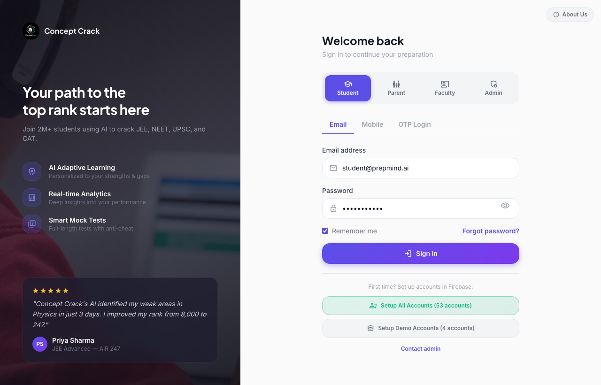
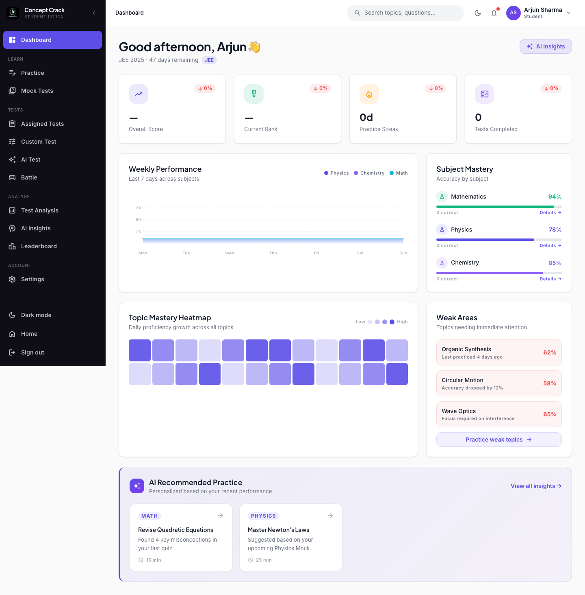
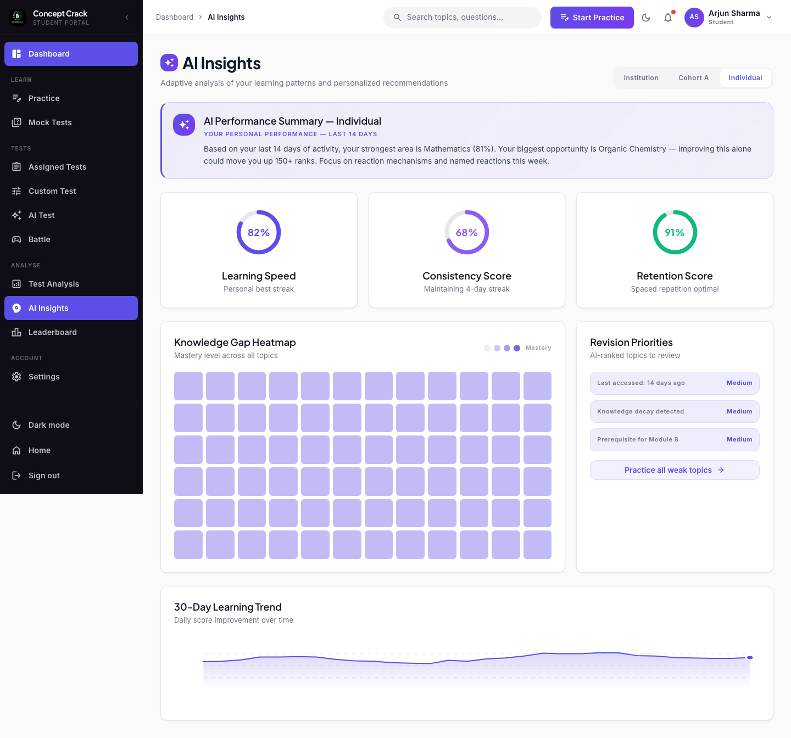
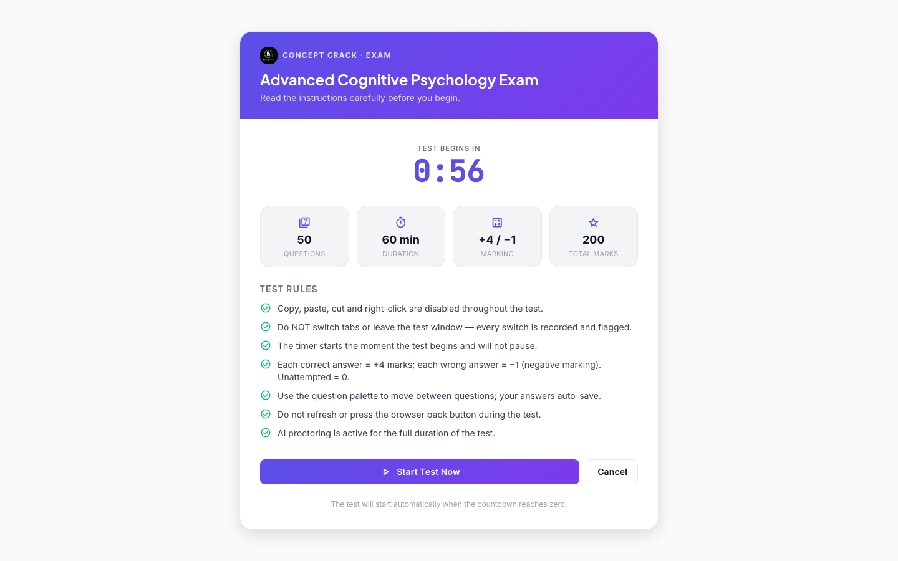
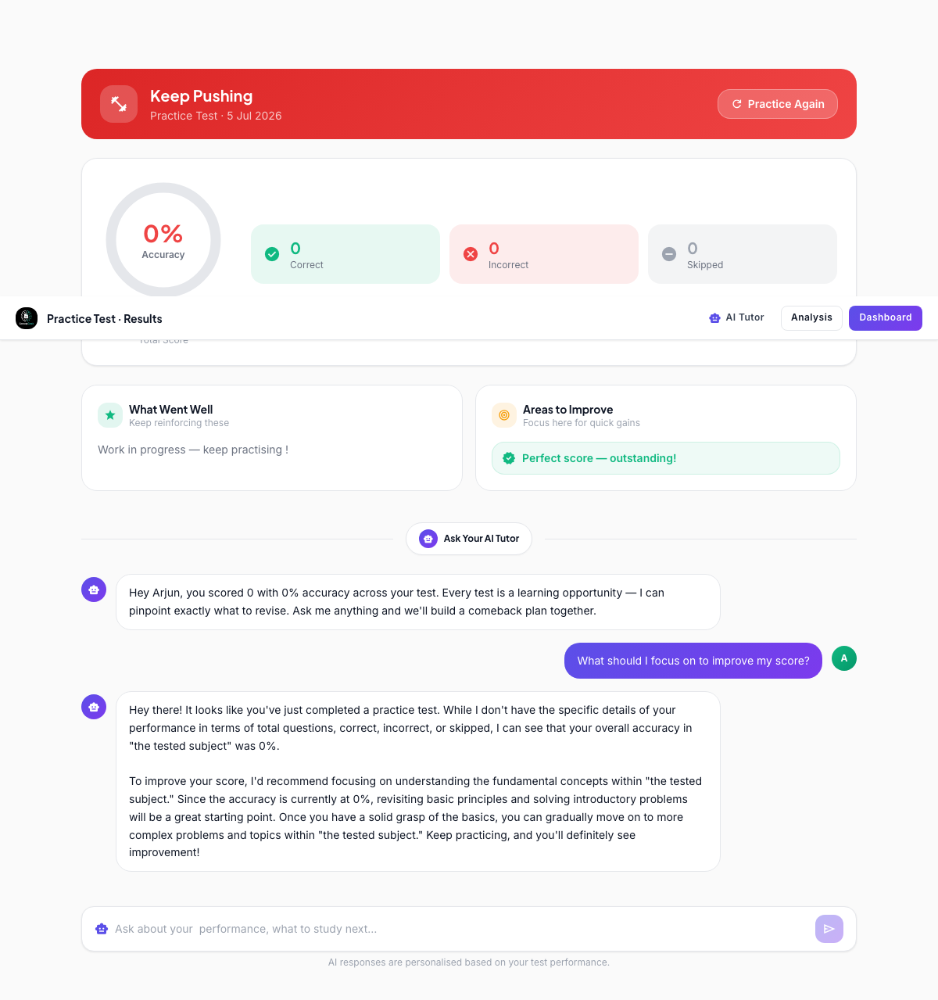
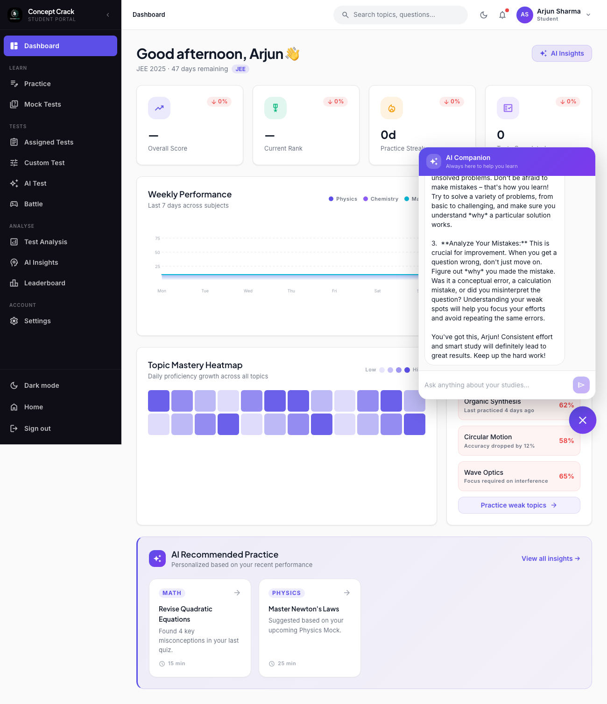
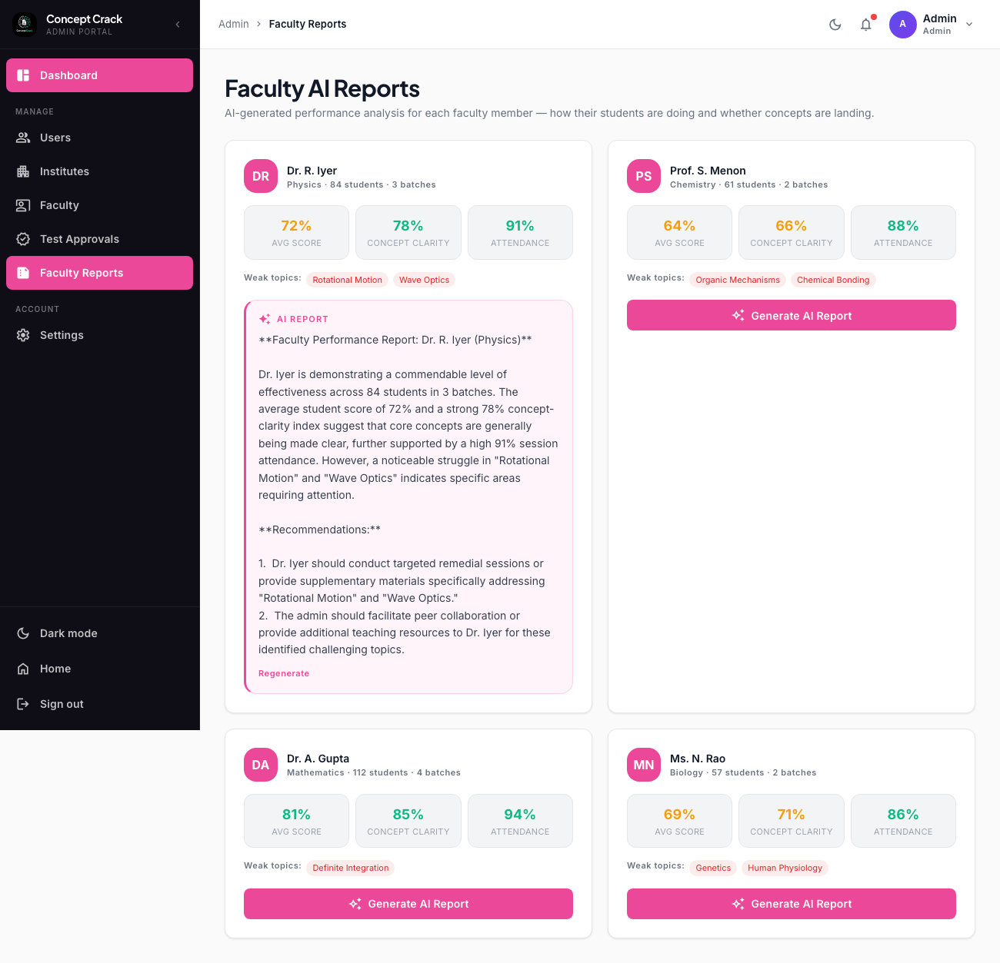

<div align="center">


# Concept Crack

### AI-powered learning & assessment platform for JEE · NEET 

Adaptive practice, proctored mock tests, deep analytics, and an AI tutor —
across dedicated **Student, Parent, Faculty, and Admin** portals.


</div>

---



## 📖 Overview

**Concept Crack** is a modern, AI-first education platform. Students get adaptive
practice, full-length proctored tests, and a personal AI tutor that understands
their actual performance. Faculty manage question banks and tests, parents track
their child's growth, and admins oversee the whole institute — each in a
purpose-built, role-based portal.

The app is a **single-page React application** backed by **Firebase** (auth +
data) with **Google Gemini** powering the AI features, deployed as a **static
site**.

---

## ✨ Features

### 🎓 Student portal
Adaptive dashboard with performance metrics, subject mastery, topic heatmaps, and
weak-area detection. Practice modules, assigned/coaching tests, custom tests, AI
tests, and 1-v-1 Battle mode.

| Dashboard | AI Insights |
|---|---|
|  |  |

### 📝 Proctored exams with integrity guardrails
Every test opens with an **instructions screen** (rules, marking scheme, and a
1-minute countdown). During the test, **copy / paste / cut / right-click are
blocked** and **tab-switching is detected, flagged, and counted** by the AI
proctor.



### 🤖 AI tutor & AI companion (powered by Gemini)
A post-test **AI tutor** analyses the student's real results and answers
follow-up questions. A floating **AI companion** is available across the student
portal for concept explanations, revision plans, and doubts.

| AI Tutor | AI Companion |
|---|---|
|  |  |

### 👨‍🏫 Faculty portal
Create and manage tests, curate a searchable **question bank** (preview + edit),
and view batch-level analytics.

### 👪 Parent portal
A read-only view of their child's rank, performance, attendance, and growth — plus
a direct **chat with the faculty**.

### 🛡️ Admin portal
Manage users, institutes, and test approvals — and generate **AI performance
reports** for each faculty member (how their students are doing and whether
concepts are landing).



---

## 🧱 Tech Stack

| Layer | Technology |
|---|---|
| Framework | React 18 + TypeScript |
| Build tool | Vite 5 |
| Styling | Tailwind CSS 3 |
| Routing | React Router 6 |
| Auth & data | Firebase (Authentication + Firestore) |
| AI | Google Gemini (`gemini-2.5-flash`) |
| Charts | Chart.js + hand-built SVG visualisations |
| Deployment | Static site (Render / any static host) |

---

## 🚀 Getting Started

### Prerequisites
- **Node.js 18+** and npm

### Install & run

```bash
# 1. Install dependencies
npm install

# 2. (Optional) enable AI features — see Environment Variables below
echo "VITE_GEMINI_API_KEY=your_key_here" > .env.local

# 3. Start the dev server
npm run dev
```

The app runs at **http://localhost:5173**.

### Build for production

```bash
npm run build     # outputs static files to dist/
npm run preview   # preview the production build locally
```

---

## 🔑 Environment Variables

Create a **`.env.local`** file in the project root (it is git-ignored):

| Variable | Required | Purpose |
|---|---|---|
| `VITE_GEMINI_API_KEY` | For AI features | Powers the AI tutor, AI companion, and admin faculty reports. Get a free key at [Google AI Studio](https://aistudio.google.com/apikey). |

> Firebase configuration is bundled in `src/lib/firebase.ts`, so the app runs
> against the hosted project out of the box — no Firebase env vars needed to try it.

> ⚠️ **Security note:** `VITE_*` variables are baked into the client bundle. For
> production, restrict the Gemini key to your domain (Google Cloud API key
> restrictions) or proxy AI calls through a backend.

---

## 🧪 Demo Accounts

Use the **"Setup Demo Accounts"** button on the login page to seed them, then log
in with any role:

| Role | Email | Password |
|---|---|---|
| Student | `student@prepmind.ai` | `Student@123` |
| Parent | `parent@prepmind.ai` | `Parent@123` |
| Faculty | `faculty@prepmind.ai` | `Faculty@123` |
| Admin | `admin@prepmind.ai` | `Admin@123` |

---

## 📁 Project Structure

```
src/
├── components/        # Shared UI (Layout, TopBar, Button, Spinner, AICompanion…)
├── lib/               # firebase, auth, ai (Gemini), theme, pages/routing, data
├── pages/
│   ├── Student/       # Dashboard, Practice, ExamInterface, AITest, Battle, AI Insights…
│   ├── Faculty/       # Dashboard, QuestionBank, CreateTest, ManageTests…
│   ├── Parent/        # Parent dashboard
│   ├── Admin/         # Users, Institutes, Test Approvals, Faculty AI Reports
│   ├── Login.tsx      # Multi-role login
│   ├── Messages.tsx   # Parent ↔ Faculty chat
│   └── Arcvion.tsx    # "Built by Arcvion" page
├── mocks/             # Mock data fallbacks
└── App.tsx            # Routes + layouts
```

---

## ☁️ Deployment

Deploy the static build (`dist/`) to any static host. On Render, the included
[`render.yaml`](render.yaml) configures a **Static Site** with an SPA rewrite so
client-side routes (e.g. `/student/insights`) work on refresh:

```yaml
routes:
  - type: rewrite
    source: /*
    destination: /index.html
```

Set `VITE_GEMINI_API_KEY` in the host's environment and **rebuild** (Vite env
vars are applied at build time).

---


